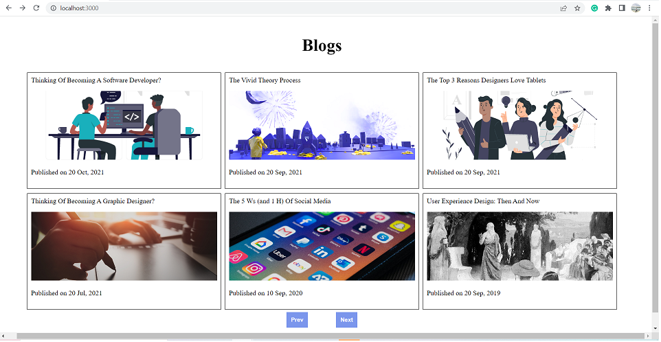
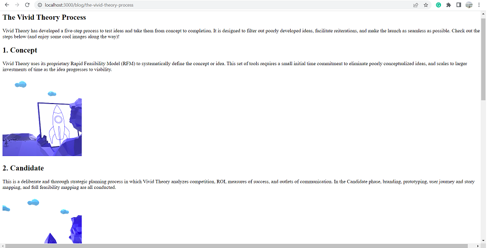

# Blogs

This project has two pages. The first page will show a list of blogs (a maximum of 6 blogs at a time). We can see more blogs with the help of the `prev` and `next` buttons. Upon clicking that blog, we will navigate to that particular blog page where we can read about that blog.

This project is built using React, TypeScript and Redux. The same project was also made using React, JavaScript and useContext API which can be found here: <https://github.com/harwindersidhu/challenge-blogs-frontend>

## Setup

- clone back-end from: <https://github.com/harwindersidhu/blogs-backend-typescript>
- Install dependencies with `npm install`.

### `npm start`

Runs the app in the development mode.\
Open [http://localhost:3000](http://localhost:3000) to view it in the browser.

The page will reload if you make edits.\
You will also see any lint errors in the console.

### `npm run build`

Builds the app for production to the `build` folder.\
It correctly bundles React in production mode and optimizes the build for the best performance.

The build is minified and the filenames include the hashes.\
Your app is ready to be deployed!

See the section about [deployment](https://facebook.github.io/create-react-app/docs/deployment) for more information.

## Screenshots

- Home page, where we can see list of blogs.

  

- When we select a blog from a list, we will navigate to that particular blog page.
  

# Dependencies

- ReactJS
- TypeScript
- Axios
- Node.js
- Redux
- React Router
- Sass
